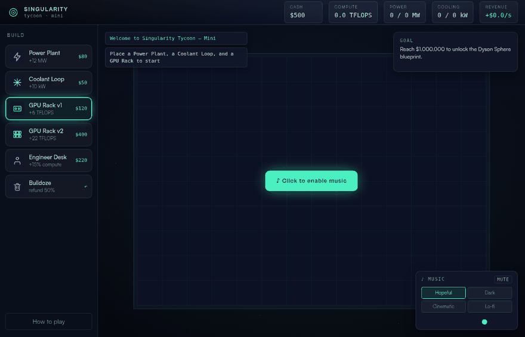

# Singularity Tycoon — Mini

A tiny browser tycoon game: run an AI data center, turn **power + cooling** into **compute**, and sell compute for cash — while balancing the **jobs your automation displaces** against the public mood. Reach **$1,000,000** to unlock the Dyson Sphere blueprint — the prologue to the full *Singularity, Inc.* game.



*Live demo recorded from the actual game: building a power plant, coolant loop, and GPU racks, bulldozing, and swapping music vibes.*

## Play it

The game is a zero-dependency static site (vanilla JS). No build step, no install, no server:

**Just open `index.html` in a browser.** Download the repo (ZIP or clone) and double-click it — works straight from `file://` on any OS.

Serving over HTTP also works, if you prefer:

```bash
python3 -m http.server 8000   # or: npx serve, php -S localhost:8000, ...
# open http://localhost:8000
```

## Documentation

| Page | What's there |
|---|---|
| [How to Play](docs/how-to-play.md) | Controls, tiles, and the goal |
| [Game Mechanics](docs/game-mechanics.md) | The economy: tick loop, formulas, and balance tables |
| [Architecture](docs/architecture.md) | Code map — rendering, state, input |
| [Audio System](docs/audio-system.md) | The procedural Web Audio music engine |
| [Known Issues](docs/known-issues.md) | Audit findings and balance caveats |

## At a glance

- **Stack:** vanilla JavaScript, Canvas 2D, Web Audio — zero dependencies, zero build step, runs from `file://`
- **Size:** ~21 KB game logic + ~12 KB procedural audio
- **Music:** four player-selectable generative vibes synthesized at runtime (no audio files)
- **Status:** playable prototype / vibes test (`v0.2` — adds the jobs & public-sentiment dial)
