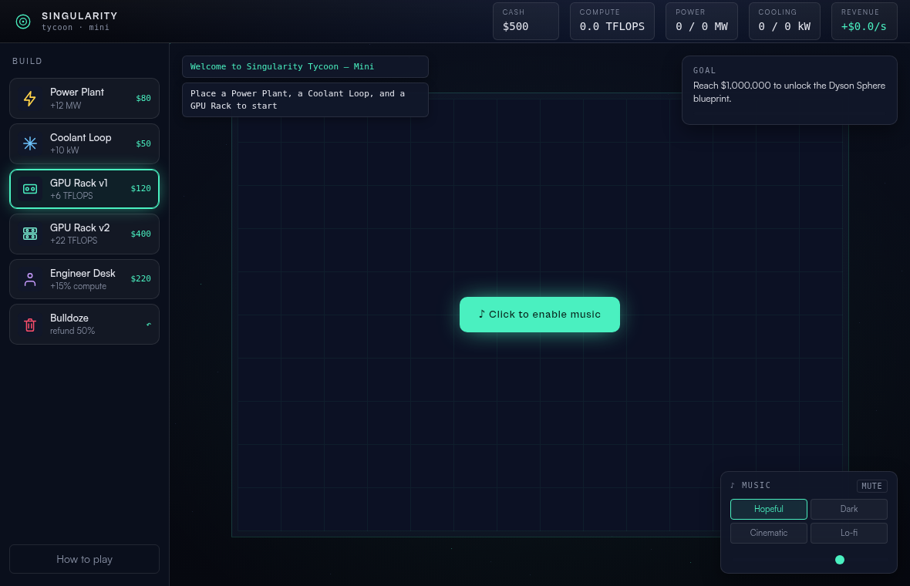
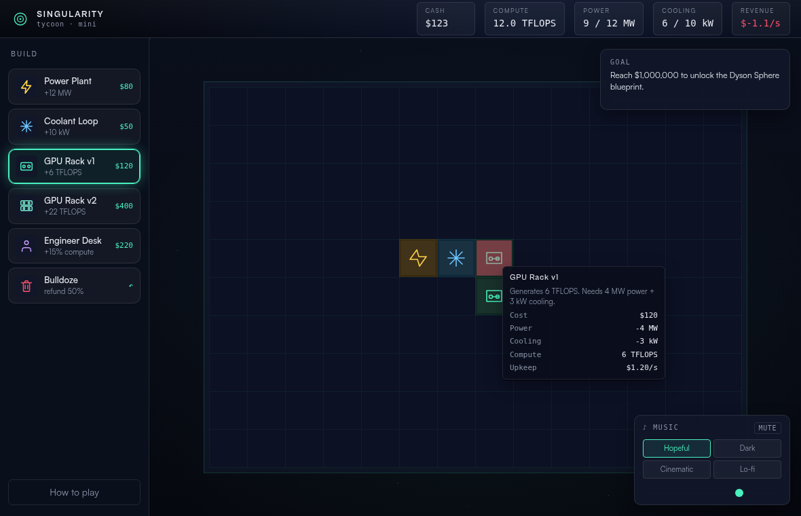
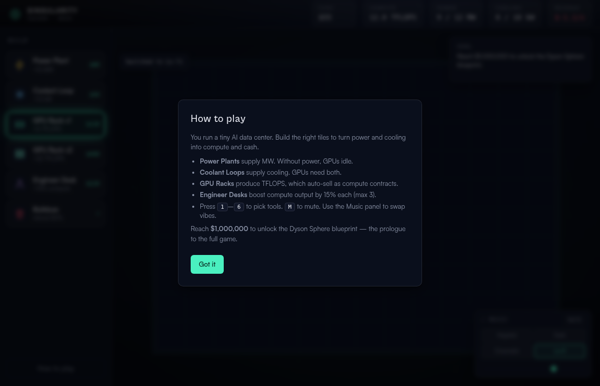

# How to Play

You run a tiny AI data center on a 14×10 grid. Build the right tiles to turn power and cooling into compute, which auto-sells as cash. **Goal: reach $1,000,000.**

## First steps

1. Click **"♪ Click to enable music"** — this dismisses the overlay (you can mute afterwards; clicks don't reach the grid until it's gone).
2. Place a **Power Plant**, a **Coolant Loop**, and a **GPU Rack** next to each other (adjacency is cosmetic — pools are global).
3. Watch the HUD: GPUs only run when there's enough free power **and** cooling.

## Controls

| Input | Action |
|---|---|
| `1`–`7` | Select tool (Power, Cooler, GPU v1, GPU v2, Desk, Retraining, Bulldoze) |
| Click grid | Place selected tile / bulldoze |
| Hover | Ghost preview (red = can't afford or occupied) and tile tooltips |
| `M` | Mute music |
| Music panel | Swap vibe: Hopeful · Dark · Cinematic · Lo-fi |

## Tiles

| Tile | Cost | Effect | Upkeep | Jobs |
|---|---|---|---|---|
| ⚡ Power Plant | $80 | +12 MW | $0.60/s | +2 |
| ❄ Coolant Loop | $50 | +10 kW cooling, draws 1 MW | $0.30/s | +1 |
| 🖥 GPU Rack v1 | $120 | +6 TFLOPS, needs 4 MW + 3 kW | $1.20/s | +1 |
| 🖥 GPU Rack v2 | $400 | +22 TFLOPS, needs 10 MW + 8 kW | $4.00/s | +2 |
| 👤 Engineer Desk | $220 | +15% compute output (stacks ×3 max), draws 1 MW | $0.50/s | +2 |
| 🎓 Retraining Ctr. | $150 | +8 jobs, draws 1 MW | $1.00/s | +8 |
| 🗑 Bulldoze | — | Refunds 50% of build cost | — | — |

Compute sells automatically at **$0.30/s per TFLOPS**.

## Jobs & public mood (new in v0.2)

Every TFLOPS you sell **displaces 0.25 jobs** in the city; your buildings create jobs. The net balance drives **Public** sentiment (the HUD meter):

| Sentiment | Mood | Effect |
|---|---|---|
| ≥ 70% | Goodwill | Utility rebate: **−15% upkeep** |
| 40–69% | Neutral | — |
| < 40% | Unrest | Power surcharge: **+25% upkeep** |
| < 25% | Protests | **Output halved** + building permits delayed 4s |

When compute scales up, displacement outpaces the jobs your tiles create — build **Retraining Centers** (or eat the penalties) to keep the city on your side. That's the trade: every dollar spent on the public is a dollar not spent on GPUs.

